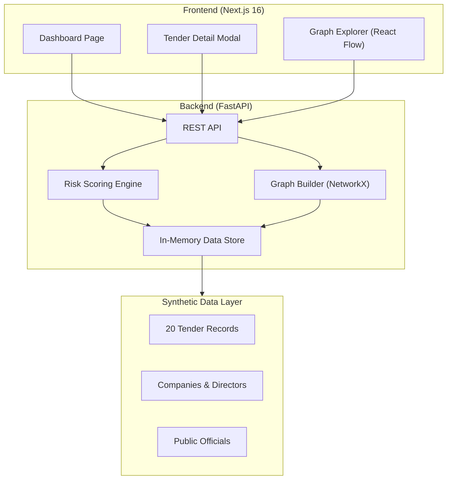

# Project Sentinel - Implementation Documentation

Sentinel is an AI-powered public procurement oversight system designed to transform opaque tender data into actionable intelligence through graph analytics and anomaly detection. This document details the architectural decisions, design patterns, and implementation status of the Sentinel MVP.

---

## 1. Executive Summary

Sentinel provides a **proactive prevention layer** for government auditors and civil society. Instead of post-mortem audits, it flags high-risk tenders _before_ contracts are finalized.

**Core Value Proposition:**

- **Real-time Risk Scoring**: Automated assessment of tenders using 5 multi-dimensional rules.
- **Shadow Graph Visualization**: Revealing hidden connections between companies, directors, and officials.
- **Explainable AI**: Every risk flag is grounded in human-readable evidence and legal justifications.

---

## 2. Architecture Overview



---

## 3. Technology & Design Decisions

### **Tech Stack**

- **Frontend**: Next.js 16 (TypeScript), TailwindCSS, **React Flow (v12)** for network visualization.
- **Backend**: FastAPI (Python 3.12), **NetworkX** for graph analytics, Pydantic for data validation.
- **Data Persistence**: In-memory data store for the MVP to prioritize performance and ease of demonstration.

### **Design Decisions**

1. **React Flow vs. Force Graphs**: We opted for React Flow to provide a highly controlled, interactive experience that allows auditors to "trace" paths logically rather than dealing with physics-based movement.
2. **Advisory Role**: Sentinel is designed as a **decision-support tool**, not a judge. It uses language like "Elevated Risk" rather than "Corrupt" to respect legal and institutional constraints.
3. **Explainability First**: Every risk score is decomposed into "Risk Factors" with specific evidence (dates, names, percentages) to ensure legal defensibility.

---

## 4. The Risk Scoring Engine

Sentinel implements 5 core rules mapped to real-world Kenyan procurement abuse patterns:

| Rule                     | Weight | Description                              | Detection Method                          |
| ------------------------ | ------ | ---------------------------------------- | ----------------------------------------- |
| **Conflict of Interest** | 30     | Relationship between winner and official | Graph path finding (bfs_successors)       |
| **Cartel Pattern**       | 25     | Consistently bidding in the same groups  | Cluster detection in co-bidding graph     |
| **Shell Company**        | 20     | Company registered just before winning   | Temporal analysis (Creation vs. Deadline) |
| **Price Anomaly**        | 15     | Price >150% above estimated value        | Statistical deviation analysis            |
| **Rushed Timeline**      | 10     | Submission window < 7 days               | Date delta analysis                       |

---

## 5. Domain Modeling & Synthetic Data

### **Knowledge Graph Schema**

- **Nodes**: `COMPANY`, `DIRECTOR`, `OFFICIAL`, `TENDER`
- **Edges**:
  - `DIRECTOR_OF` (Person -> Company)
  - `AWARD_BY` (Tender -> Official)
  - `WON` / `BID_ON` (Company -> Tender)
  - `RELATED_TO` (Official <-> Director)
  - `SHARES_ADDRESS` / `SHARES_PHONE` (Company <-> Company)

### **The "Wanjiku Construction" Story (Synthetic Scenario)**

The MVP's synthetic data tells three specific stories of corruption:

- **The Cartel**: 4 companies sharing the same Industrial Area plot that rotate wins.
- **The Shell**: A 4-day-old company winning a KES 78M IT contract.
- **The Conflict**: A KEMSA official awarding a contract to his brother's firm.

---

## 6. Implementation Status

### **Backend (Complete)**

- [x] Pydantic domain models ([models.py](backend/models.py))
- [x] NetworkX Graph construction logic ([graph/builder.py](backend/graph/builder.py))
- [x] Explainable Risk Engine ([risk/engine.py](backend/risk/engine.py))
- [x] 20-tender synthetic data generator ([data/synthetic.py](backend/data/synthetic.py))
- [x] REST API endpoints ([main.py](backend/main.py))

### **Frontend (Complete)**

- [x] Dashboard with Pulse navigation for High Risk tenders.
- [x] Explainable Evidence modal for every tender.
- [x] Interactive Shadow Graph with suspicious edge highlighting.
- [x] Responsive layout with TailwindCSS.

---

## 7. How to Run & Demo

### **1. Start Backend**

```bash
cd backend
uv run uvicorn main:app --reload --port 8000
```

### **2. Start Frontend**

```bash
cd frontend/ui
pnpm dev
```

### **3. Demo Flow (The Auditor's Journey)**

1. **Discover**: Open the dashboard at `localhost:3000`. Sort by "Risk Score".
2. **Audit**: Click on the **Enterprise IT Modernization** tender (HIGH RISK).
3. **Investigate**: Read the evidence (registered 4 days ago, 5-day window).
4. **Trace**: Click "Explore Connections" to see the family tie between the Director and the Official in the Shadow Graph.
5. **Action**: View the "Recommended Actions" (Freeze payment, Escalate to internal audit).

---

## 8. API Reference

| Endpoint             | Method | Response                                             |
| -------------------- | ------ | ---------------------------------------------------- |
| `/api/stats`         | GET    | Global procurement health metrics                    |
| `/api/tenders`       | GET    | Risk-scored tender list (filtered by category/level) |
| `/api/tenders/{id}`  | GET    | Full risk breakdown + bidder list                    |
| `/api/graph/explore` | GET    | Full knowledge graph in React Flow format            |

---

## 9. Success Criteria

- ✅ **Prevention**: Tenders are flagged _before_ contract signing.
- ✅ **Transparency**: Auditors can see _why_ a tender is risky.
- ✅ **Network Awareness**: The system detects cartels across multiple disconnected tenders.
- ✅ **Institutional Fit**: Output respects the advisory role of oversight bodies.

---

_Developed for the AI Hackathon 2026 - Track: Governance & Public Policy._
