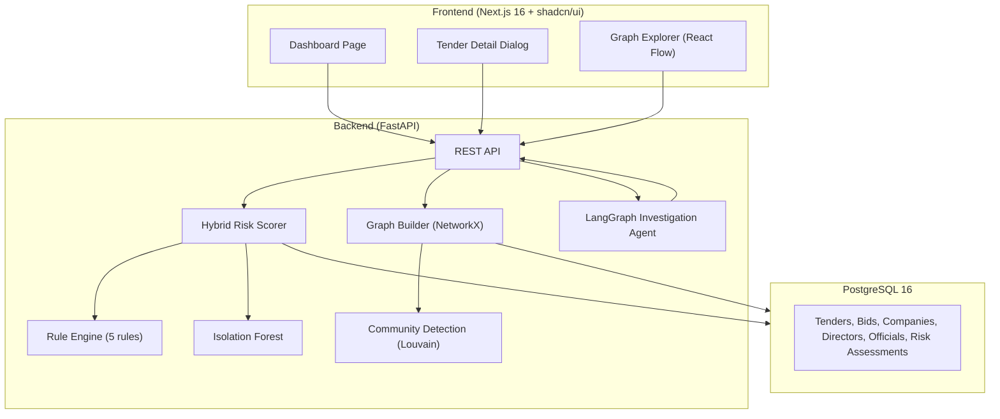

# Project Sentinel - Implementation Documentation

Sentinel is an AI-powered public procurement oversight system that transforms opaque tender data into actionable intelligence through **hybrid risk scoring** (rules + ML), **graph analytics**, and **LLM-powered explainability**.

---

## 1. Executive Summary

Sentinel provides a **proactive prevention layer** for government auditors and civil society. Instead of post-mortem audits, it flags high-risk tenders _before_ contracts are finalized.

**Core Value Proposition:**

- **Hybrid Risk Scoring**: 5 rule-based checks fused with Isolation Forest anomaly detection (60/40 weighting).
- **Shadow Graph Visualization**: Revealing hidden connections between companies, directors, and officials with community detection (Louvain).
- **Grounded AI Explanations**: LangGraph agent with evidence packs ensures every explanation cites real data — never hallucinated.
- **PostgreSQL Persistence**: Production-grade async database with Alembic migrations.

---

## 2. Architecture Overview


```mermaid
graph TB
    subgraph Frontend["Frontend (Next.js 16 + shadcn/ui)"]
        Dashboard["Dashboard Page"]
        Modal["Tender Detail Dialog"]
        GraphExplorer["Graph Explorer (React Flow)"]
    end

    subgraph Backend["Backend (FastAPI)"]
        API["REST API"]
        HybridScorer["Hybrid Risk Scorer"]
        RuleEngine["Rule Engine (5 rules)"]
        MLEngine["Isolation Forest"]
        GraphBuilder["Graph Builder (NetworkX)"]
        Communities["Community Detection (Louvain)"]
        Agent["LangGraph Investigation Agent"]
    end

    subgraph Database["PostgreSQL 16"]
        Tables["Tenders, Bids, Companies, Directors, Officials, Risk Assessments"]
    end

    Dashboard --> API
    Modal --> API
    GraphExplorer --> API
    API --> HybridScorer
    API --> GraphBuilder
    API --> Agent
    HybridScorer --> RuleEngine
    HybridScorer --> MLEngine
    GraphBuilder --> Communities
    Agent --> API
    HybridScorer --> Database
    GraphBuilder --> Database
```

---

## 3. Technology & Design Decisions

### **Tech Stack**

- **Frontend**: Next.js 16 (TypeScript), TailwindCSS v4, shadcn/ui, React Flow (v12)
- **Backend**: FastAPI (Python 3.12), async SQLAlchemy + asyncpg, NetworkX, scikit-learn, LangChain v1 + LangGraph
- **Database**: PostgreSQL 16 with Alembic migrations
- **ML**: Isolation Forest (12 engineered features), StandardScaler normalization
- **LLM**: Provider-agnostic via `init_chat_model` (OpenAI, Anthropic, Ollama, etc.)

### **Design Decisions**

1. **Hybrid Intelligence**: Rules provide interpretable baselines; ML catches novel patterns. 60/40 fusion ensures explainability is never sacrificed.
2. **Advisory Role**: Sentinel is a **decision-support tool**, not a judge. Language like "elevated risk" and "warrants review" respects legal constraints.
3. **Evidence Packs**: Structured context bundles (tender summary, risk factors, graph paths, metrics) ground LLM output and prevent hallucination.
4. **Provider-Agnostic LLM**: `init_chat_model` supports OpenAI, Anthropic, Google, Ollama — swap via environment variables.

---

## 4. The Hybrid Risk Scoring Engine

### Rule-Based Detection (60% weight)

| Rule                     | Weight | Detection Method                         |
| ------------------------ | ------ | ---------------------------------------- |
| **Conflict of Interest** | 30     | Graph shortest-path to officials         |
| **Cartel Pattern**       | 25     | Co-bidding cluster detection             |
| **Shell Company**        | 20     | Temporal analysis (registration vs. bid) |
| **Price Anomaly**        | 15     | Statistical deviation from category mean |
| **Rushed Timeline**      | 10     | Submission window analysis               |

### ML Anomaly Detection (40% weight)

12 engineered features fed to Isolation Forest:

- **Price**: `price_ratio`, `price_zscore`
- **Timeline**: `timeline_days`
- **Competition**: `bidder_count`, `bid_spread`, `winner_margin`
- **Vendor**: `company_age_days`, `win_rate`
- **Graph**: `graph_degree`, `suspicious_edges`, `official_distance`, `community_size`

---

## 5. Domain Modeling & Synthetic Data

### **Knowledge Graph Schema**

- **Nodes**: `COMPANY`, `DIRECTOR`, `OFFICIAL`, `TENDER`
- **Edges**: `DIRECTOR_OF`, `AWARDED_BY`, `WON`, `BID_ON`, `RELATED_TO`, `SHARES_ADDRESS`, `SHARES_PHONE`

### **Embedded Fraud Scenarios**

- **The Cartel**: 5 companies (Wanjiku Construction cluster) sharing directors/phones, rotating wins.
- **The Shell**: FastTrack Solutions — 4-day-old company winning a KES 78M IT contract.
- **The Conflict**: HealthFirst Medical Supplies — official's relative's firm awarded at 80% above estimate.

---

## 6. Implementation Status

### **Backend**

- [x] PostgreSQL schema with async SQLAlchemy ORM (`db/models.py`, `db/config.py`)
- [x] Alembic migrations (`alembic/`)
- [x] Async CRUD repository (`db/repository.py`)
- [x] Database seeding from synthetic data (`db/seed.py`)
- [x] Pydantic ↔ SQLAlchemy mappers (`db/mappers.py`)
- [x] Rule-based risk engine (`risk/engine.py`)
- [x] Feature engineering — 12 features (`ml/features.py`)
- [x] Isolation Forest anomaly detector (`ml/anomaly_detector.py`)
- [x] Hybrid risk scorer (`ml/hybrid_scorer.py`)
- [x] Community detection with Louvain (`graph/communities.py`)
- [x] LangGraph investigation agent (`intelligence/agent.py`)
- [x] Evidence pack builder (`intelligence/evidence.py`)
- [x] REST API with 14 endpoints (`main.py`)

### **Frontend**

- [x] shadcn/ui component library (Card, Dialog, Button, Badge, etc.)
- [x] Dashboard with stat cards and risk-filtered tender list
- [x] Tender detail dialog with risk factor breakdown
- [x] Interactive Shadow Graph with React Flow
- [x] Graph explorer page

### **Infrastructure**

- [x] Docker Compose (PostgreSQL + backend + frontend)
- [x] Railway deployment configs
- [x] Dockerfiles for backend and frontend

---

## 7. How to Run

### **Option A: Docker Compose (recommended)**

```bash
docker compose up --build
```

Open `http://localhost:3000`.

### **Option B: Local Development**

```bash
# 1. Start PostgreSQL
docker run -d --name sentinel-db -e POSTGRES_USER=sentinel -e POSTGRES_PASSWORD=sentinel -e POSTGRES_DB=sentinel -p 5432:5432 postgres:16-alpine

# 2. Backend
cd backend
cp .env.example .env
uv sync
uv run alembic upgrade head
uv run python seed.py
uv run uvicorn main:app --reload --port 8000

# 3. Frontend
cd frontend/ui
npm install
npm run dev
```

### **LLM Configuration (optional)**

Set in `.env` to enable AI-powered explanations:

```bash
LLM_MODEL=gpt-4o-mini
LLM_PROVIDER=openai
OPENAI_API_KEY=sk-...

# Or use Ollama for local models:
LLM_MODEL=llama3
LLM_PROVIDER=ollama
LLM_BASE_URL=http://localhost:11434/v1
```

Without an LLM key, the system falls back to structured template explanations.

---

## 8. API Reference

| Endpoint                            | Method | Description                               |
| ----------------------------------- | ------ | ----------------------------------------- |
| `/api/stats`                        | GET    | Dashboard statistics                      |
| `/api/tenders`                      | GET    | Risk-scored tender list (filterable)      |
| `/api/tenders/{id}`                 | GET    | Full risk breakdown + bidder list         |
| `/api/tenders/{id}/graph`           | GET    | Tender subgraph (k-hop)                   |
| `/api/tenders/{id}/evidence`        | GET    | Structured evidence pack                  |
| `/api/tenders/{id}/explain`         | GET    | AI-generated risk explanation             |
| `/api/graph/explore`                | GET    | Full shadow graph                         |
| `/api/graph/cartels`                | GET    | Detected cartel clusters                  |
| `/api/graph/communities`            | GET    | Louvain communities with suspicion scores |
| `/api/graph/communities/{id}`       | GET    | Community subgraph                        |
| `/api/graph/path?source=X&target=Y` | GET    | Shortest path between entities            |
| `/api/graph/entity/{id}`            | GET    | Entity neighborhood (k-hop)               |
| `/api/companies/{id}`               | GET    | Company details + directors               |

---

## 9. Demo Flow (The Auditor's Journey)

1. **Discover**: Open dashboard. High-risk tenders pulse with red indicators.
2. **Audit**: Click **Supply of Pharmaceutical Products** (risk score: 61).
3. **Understand**: Read 3 risk factors — conflict of interest, price anomaly (80% above estimate), ML anomaly (score: 100/100).
4. **Trace**: Click "Explore Connections" to see the path between HealthFirst Medical and the procurement officer.
5. **Investigate**: Hit `/api/tenders/{id}/explain` for an AI-generated audit brief.
6. **Cluster**: Visit `/api/graph/communities` to see the Wanjiku Construction cartel (suspicion: 85/100).

---

_Developed for the AI Hackathon 2026 - Track: Governance & Public Policy._
