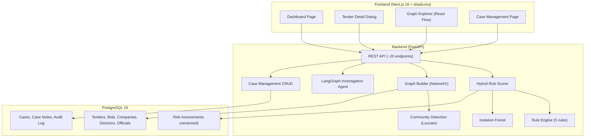

# Project Sentinel - Implementation Documentation

Sentinel is an AI-powered public procurement oversight system that transforms opaque tender data into actionable intelligence through **hybrid risk scoring** (rules + ML), **graph analytics**, **LLM-powered explainability**, and **case management workflows**.

---

## 1. Executive Summary

Sentinel provides a **proactive prevention layer** for government auditors and civil society. Instead of post-mortem audits, it flags high-risk tenders _before_ contracts are finalized.

**Core Value Proposition:**

- **Hybrid Risk Scoring**: 5 rule-based checks fused with Isolation Forest anomaly detection (60/40 weighting).
- **Shadow Graph Visualization**: Revealing hidden connections between companies, directors, and officials with community detection (Louvain).
- **Grounded AI Explanations**: LangGraph agent with evidence packs ensures every explanation cites real data — never hallucinated.
- **Case Management**: Full investigation workflow — open cases from flagged tenders, add typed notes, transition through status stages, record decisions.
- **PostgreSQL Persistence**: Production-grade async database with Alembic migrations and audit trail.

---

## 2. Architecture Overview


```mermaid
graph TB
    subgraph Frontend["Frontend (Next.js 16 + shadcn/ui)"]
        Dashboard["Dashboard Page"]
        Modal["Tender Detail Dialog"]
        GraphExplorer["Graph Explorer (React Flow)"]
        CaseMgmt["Case Management Page"]
    end

    subgraph Backend["Backend (FastAPI)"]
        API["REST API (~20 endpoints)"]
        HybridScorer["Hybrid Risk Scorer"]
        RuleEngine["Rule Engine (5 rules)"]
        MLEngine["Isolation Forest"]
        GraphBuilder["Graph Builder (NetworkX)"]
        Communities["Community Detection (Louvain)"]
        Agent["LangGraph Investigation Agent"]
        CaseAPI["Case Management CRUD"]
    end

    subgraph Database["PostgreSQL 16"]
        CoreTables["Tenders, Bids, Companies, Directors, Officials"]
        RiskTables["Risk Assessments (versioned)"]
        CaseTables["Cases, Case Notes, Audit Log"]
    end

    Dashboard --> API
    Modal --> API
    GraphExplorer --> API
    CaseMgmt --> API
    API --> HybridScorer
    API --> GraphBuilder
    API --> Agent
    API --> CaseAPI
    HybridScorer --> RuleEngine
    HybridScorer --> MLEngine
    GraphBuilder --> Communities
    CaseAPI --> CaseTables
    HybridScorer --> RiskTables
    GraphBuilder --> CoreTables
```

---

## 3. Technology & Design Decisions

### **Tech Stack**

| Layer      | Technology                                           | Rationale                                           |
| ---------- | ---------------------------------------------------- | --------------------------------------------------- |
| Frontend   | Next.js 16 + TypeScript + TailwindCSS v4 + shadcn/ui | SSR, type safety, accessible component library      |
| Graph Viz  | React Flow v12                                       | Controlled layouts, performance at MVP scale        |
| Backend    | FastAPI + Python 3.12                                | Async, type hints, ML ecosystem                     |
| Database   | PostgreSQL 16 + async SQLAlchemy + Alembic           | ACID, JSON support, migration management            |
| Graph      | NetworkX                                             | Simplicity at MVP scale, clear Neo4j migration path |
| ML         | scikit-learn (Isolation Forest)                      | Production-ready, interpretable                     |
| LLM        | LangChain v1 + LangGraph (`init_chat_model`)         | Provider-agnostic: OpenAI, Anthropic, Ollama        |
| Deployment | Docker Compose + Railway                             | Hackathon-friendly, scales to K8s                   |

### **Key Design Decisions**

1. **Hybrid Intelligence**: Rules provide interpretable baselines; ML catches novel patterns. 60/40 fusion ensures explainability is never sacrificed.
2. **Advisory Role**: Sentinel is a **decision-support tool**, not a judge. Language like "elevated risk" and "warrants review" respects legal and institutional constraints.
3. **Evidence Packs**: Structured context bundles (tender summary, risk factors, graph paths, metrics) ground LLM output and prevent hallucination.
4. **Provider-Agnostic LLM**: `init_chat_model` supports OpenAI, Anthropic, Google, Ollama — swap via environment variables. Falls back to template explanations without an API key.
5. **Cluster-First Graph UX**: Community sidebar replaces "spaghetti" full-graph view. Click a cluster to load its subgraph with shared-attribute indicators.
6. **Case Workflow**: Status machine (OPEN → INVESTIGATING → ESCALATED → RESOLVED/DISMISSED) with typed notes (OBSERVATION, EVIDENCE, DECISION, ACTION) and audit logging.

---

## 4. The Hybrid Risk Scoring Engine

### Rule-Based Detection (60% weight)

| Rule                     | Weight | Detection Method                         |
| ------------------------ | ------ | ---------------------------------------- |
| **Conflict of Interest** | 30     | Graph shortest-path to officials         |
| **Cartel Pattern**       | 25     | Co-bidding cluster detection             |
| **Shell Company**        | 20     | Temporal analysis (registration vs. bid) |
| **Price Anomaly**        | 15     | Statistical deviation from category mean |
| **Rushed Timeline**      | 10     | Submission window analysis               |

### ML Anomaly Detection (40% weight)

12 engineered features fed to Isolation Forest:

- **Price**: `price_ratio`, `price_zscore`
- **Timeline**: `timeline_days`
- **Competition**: `bidder_count`, `bid_spread`, `winner_margin`
- **Vendor**: `company_age_days`, `win_rate`
- **Graph**: `graph_degree`, `suspicious_edges`, `official_distance`, `community_size`

---

## 5. Domain Modeling & Synthetic Data

### **Knowledge Graph Schema**

- **Nodes**: `COMPANY`, `DIRECTOR`, `OFFICIAL`, `TENDER`
- **Edges**: `DIRECTOR_OF`, `AWARDED_BY`, `WON`, `BID_ON`, `RELATED_TO`, `SHARES_ADDRESS`, `SHARES_PHONE`

### **Embedded Fraud Scenarios**

- **The Cartel**: 5 companies (Wanjiku Construction cluster) sharing directors/phones, rotating wins.
- **The Shell**: FastTrack Solutions — 4-day-old company winning a KES 78M IT contract.
- **The Conflict**: HealthFirst Medical Supplies — official's relative's firm awarded at 80% above estimate.

---

## 6. Case Management

### Investigation Workflow

```
OPEN ──▶ INVESTIGATING ──▶ ESCALATED ──▶ RESOLVED
  │            │
  │            └──▶ RESOLVED
  │            └──▶ DISMISSED
  └──▶ DISMISSED
```

### Features

- **Open Case** directly from any tender's detail view (priority auto-inherited from risk score)
- **Typed Notes**: OBSERVATION, EVIDENCE, DECISION, ACTION — timestamped with author attribution
- **Status Transitions**: Controlled state machine with valid next-states per current status
- **Case Stats**: Dashboard with counts per status (open, investigating, escalated, resolved, dismissed)
- **Audit Trail**: Every case creation and status change logged to `audit_log` table

### Database Tables

- `cases`: id, tender_id, title, status, priority, assigned_to, created_by, summary, decision, timestamps
- `case_notes`: id, case_id, author, content, note_type, created_at

---

## 7. Implementation Status

### **Backend** (`backend/`)

- [x] PostgreSQL schema with async SQLAlchemy ORM (`db/models.py`, `db/config.py`)
- [x] Alembic migrations (`alembic/`)
- [x] Async CRUD repository (`db/repository.py`)
- [x] Database seeding from synthetic data (`db/seed.py`)
- [x] Pydantic ↔ SQLAlchemy mappers (`db/mappers.py`)
- [x] Rule-based risk engine — 5 rules (`risk/engine.py`)
- [x] Feature engineering — 12 features (`ml/features.py`)
- [x] Isolation Forest anomaly detector (`ml/anomaly_detector.py`)
- [x] Hybrid risk scorer — 60/40 fusion (`ml/hybrid_scorer.py`)
- [x] Community detection with Louvain (`graph/communities.py`)
- [x] LangGraph investigation agent with `init_chat_model` (`intelligence/agent.py`)
- [x] Evidence pack builder (`intelligence/evidence.py`)
- [x] Case management — CRUD, notes, status transitions, stats (`main.py`, `db/repository.py`)
- [x] Audit trail logging (`db/repository.py`)
- [x] REST API with ~20 endpoints (`main.py`)

### **Frontend** (`frontend/ui/`)

- [x] shadcn/ui component library (Card, Dialog, Button, Badge, Separator, ScrollArea)
- [x] Dashboard (`/`) with stat cards, risk-filtered tender list, nav to Cases + Graph
- [x] Tender detail dialog with risk factor breakdown + "Open Case" button
- [x] Interactive Shadow Graph with React Flow
- [x] Graph explorer (`/graph`) with cluster-first sidebar + community subgraphs
- [x] Case management page (`/cases`) with status tabs, case detail dialog, notes, status transitions

### **Infrastructure**

- [x] Docker Compose (PostgreSQL + backend + frontend)
- [x] Dockerfiles for backend (uv + Python 3.12) and frontend (Next.js standalone)
- [x] Railway deployment configs (`railway.toml`)

---

## 8. How to Run

### **Option A: Docker Compose (recommended)**

```bash
docker compose up --build
```

Open `http://localhost:3000`.

### **Option B: Local Development**

```bash
# 1. Start PostgreSQL
docker run -d --name sentinel-db -e POSTGRES_USER=sentinel -e POSTGRES_PASSWORD=sentinel -e POSTGRES_DB=sentinel -p 5432:5432 postgres:16-alpine

# 2. Backend
cd backend
cp .env.example .env
uv sync
uv run alembic upgrade head
uv run python seed.py
uv run uvicorn main:app --reload --port 8000

# 3. Frontend
cd frontend/ui
npm install
npm run dev
```

### **LLM Configuration (optional)**

Set in `.env` to enable AI-powered explanations:

```bash
LLM_MODEL=gpt-4o-mini
LLM_PROVIDER=openai
OPENAI_API_KEY=sk-...

# Or use Ollama for local models:
LLM_MODEL=llama3
LLM_PROVIDER=ollama
LLM_BASE_URL=http://localhost:11434/v1
```

Without an LLM key, the system falls back to structured template explanations.

---

## 9. API Reference

| Endpoint                            | Method | Description                                |
| ----------------------------------- | ------ | ------------------------------------------ |
| `/api/stats`                        | GET    | Dashboard statistics                       |
| `/api/tenders`                      | GET    | Risk-scored tender list (filterable)       |
| `/api/tenders/{id}`                 | GET    | Full risk breakdown + bidder list          |
| `/api/tenders/{id}/graph`           | GET    | Tender subgraph (k-hop)                    |
| `/api/tenders/{id}/evidence`        | GET    | Structured evidence pack                   |
| `/api/tenders/{id}/explain`         | GET    | AI-generated risk explanation              |
| `/api/tenders/{id}/cases`           | GET    | Cases associated with a tender             |
| `/api/graph/explore`                | GET    | Full shadow graph                          |
| `/api/graph/cartels`                | GET    | Detected cartel clusters                   |
| `/api/graph/communities`            | GET    | Louvain communities with suspicion scores  |
| `/api/graph/communities/{id}`       | GET    | Community subgraph                         |
| `/api/graph/path?source=X&target=Y` | GET    | Shortest path between entities             |
| `/api/graph/entity/{id}`            | GET    | Entity neighborhood (k-hop)                |
| `/api/companies/{id}`               | GET    | Company details + directors                |
| `/api/cases`                        | GET    | List cases (filterable by status/priority) |
| `/api/cases`                        | POST   | Create investigation case for a tender     |
| `/api/cases/stats`                  | GET    | Case status breakdown counts               |
| `/api/cases/{id}`                   | GET    | Case detail with notes                     |
| `/api/cases/{id}`                   | PATCH  | Update case status/priority/decision       |
| `/api/cases/{id}/notes`             | POST   | Add typed investigation note               |

---

## 10. Demo Flow (The Auditor's Journey)

### Scenario A: Cartel Detection

1. **Discover**: Open dashboard → filter by HIGH risk.
2. **Cluster**: Navigate to Shadow Graph (`/graph`) → sidebar shows "Wanjiku Construction" cluster (suspicion: 85).
3. **Investigate**: Click cluster → subgraph reveals 5 companies sharing phones, directors, and addresses.
4. **Case**: Return to dashboard → click tender → "Open Case" → auto-creates investigation with HIGH priority.
5. **Document**: Add EVIDENCE note: "5 companies share Industrial Area address, phone rotation detected."

### Scenario B: Shell Company + Rushed Timeline

1. **Dashboard**: HIGH risk tender — Enterprise IT Modernization.
2. **Detail**: Click → Shell Company (20pts) + Rushed Timeline (10pts) + ML anomaly.
3. **Explain**: Hit `/api/tenders/{id}/explain` → AI brief: "FastTrack Solutions registered 4 days before deadline."
4. **Action**: Open case → transition to INVESTIGATING → add DECISION note: "Freeze payment pending verification."

### Scenario C: Conflict of Interest

1. **Dashboard**: Supply of Pharmaceutical Products (risk score: 61).
2. **Detail**: Conflict of Interest (30pts) — director is sibling of procurement officer.
3. **Trace**: "Explore Connections" → graph highlights Director → Official path.
4. **Case**: Open case → ESCALATED → add ACTION note: "Refer to internal audit committee."

---

_Developed for the AI Hackathon 2026 - Track: Governance & Public Policy._
